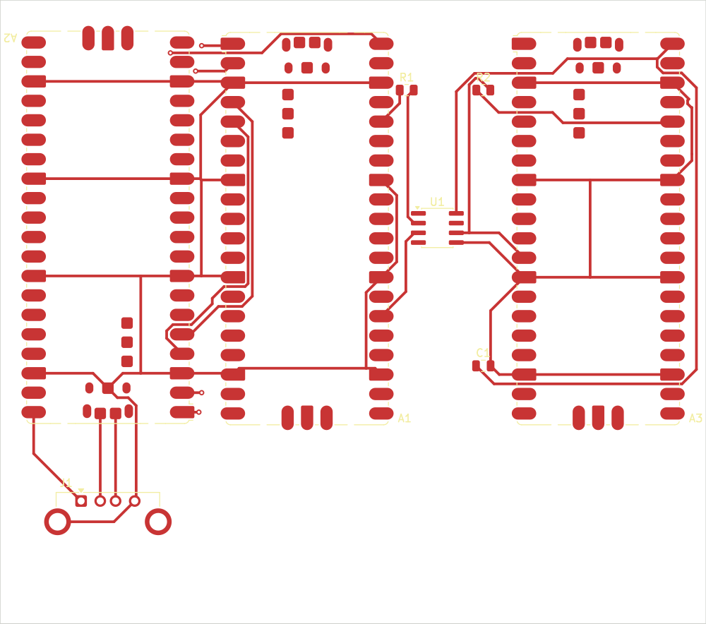

# Screen Hopper - triple Pico 2 carrier PCB

A carrier board for the triple-Pico version of Screen Hopper. The three Raspberry Pi Pico 2 boards, the 6N137 optocoupler, the two resistors, a bypass capacitor and a USB-A host port all mount on one PCB, replacing the breadboard and jumper wires described in [HARDWARE.md](../HARDWARE.md).

Three variants are provided from the same netlist:

| Variant | Folder | Size | Assembly |
| ------- | ------ | ---- | -------- |
| Compact SMD | [`smd/`](smd/) | 92 x 82 mm | Optocoupler + passives reflowed by the fab; you mount the three Picos flat, single-sided |
| Through-hole | [`tht/`](tht/) | 112 x 106 mm | You solder everything; Picos A and Forwarder on headers |
| Double-sided | [`compact/`](compact/) | 83 x 59 mm | Smallest. Pico B reflows on the back under Pico A; adds a USB-C host port |



The double-sided `compact` variant is the smallest board. It stacks Pico B on the back copper directly beneath Pico A and offers both a USB-C and a USB-A host receptacle - **populate only one** (see [Host connector](#host-connector-compact-variant)). It needs the finer JLCPCB 6/6 process (0.2 mm tracks, 0.15 mm clearance, 0.5/0.3 mm vias) to fan out the 0.5 mm-pitch USB-C, where the other two run on the relaxed cheap-everywhere rules.

## The one thing that matters: galvanic isolation

The 6N137 optocoupler exists to keep the two host computers electrically isolated. Pico A and Pico B share power and ground fed from computer 1 (and the input device); the Forwarder runs on its own power and ground fed from computer 2. The only connection between the two sides is the optocoupler's internal LED-to-phototransistor light path.

The board enforces this with **two separate ground/power nets** (`GND1`/`VBUS1` and `GND2`/`VBUS2`) and a **copper keepout gap under the optocoupler** that no track or pour may cross. Domain 1 copper stops just left of the opto's input pins; domain 2 copper starts just right of its output pins. Do not bridge the two sides with a wire, a ground pour, or a mounting screw/standoff that ties the grounds together - that defeats the isolation and can create a ground loop between two separate computers.

## What to send to the PCB fab

For a **bare board** (any variant), upload the gerber zip:

- `smd/screen-hopper-smd-gerbers.zip`, `tht/screen-hopper-tht-gerbers.zip` or `compact/screen-hopper-compact-gerbers.zip`

Fab settings: **2 layers, 1.6 mm FR-4, 1 oz copper, HASL or ENIG**. The `smd`/`tht` boards use 0.35 mm tracks, 0.2 mm clearance and 0.35 mm drills, which every fab (PCBWay, JLCPCB, etc.) handles at the cheapest tier. The `compact` board needs 0.2 mm tracks, 0.15 mm clearance and 0.3 mm drills to escape the USB-C - order it from **JLCPCB** (its standard 6/6 process and cheapest tier cover this).

For an **SMD board assembled** by the fab, also supply:

- `BOM-smd.csv` or `BOM-compact.csv` - bill of materials
- the matching `-positions.csv` - centroid / pick-and-place file

The fab can place the optocoupler (SOIC-8), the 0805 resistors and the 0805 capacitor (and, on `compact`, the SMD USB-C receptacle and the two CC resistors). The three Pico 2 modules are not standard catalogue parts, so either hand-solder them onto the castellated pads yourself or consign them to the fab. The USB-A receptacle is through-hole and is usually hand-soldered. The `compact` board places parts on **both sides** - tell the fab it is a double-sided assembly (Pico B is the only part on the back).

## Bill of materials

See [`BOM-smd.csv`](BOM-smd.csv), [`BOM-tht.csv`](BOM-tht.csv) and [`BOM-compact.csv`](BOM-compact.csv). Summary:

| Ref | Part | SMD | THT | Compact |
| --- | ---- | --- | --- | ------- |
| A1, A2, A3 | Raspberry Pi Pico 2 (x3) | flat castellated mount | A/Fwd on headers, B flat | flat; B on the back under A |
| U1 | 6N137 optocoupler | SOIC-8 | DIP-8 (+ socket) | SOIC-8 |
| R1 | 470 R (opto LED limit) | 0805 | axial 1/4 W | 0805 |
| R2 | 680 R (opto VO pull-up) | 0805 | axial 1/4 W | 0805 |
| R3, R4 | 56 k (USB-C CC pull-ups) | - | - | 0805 (compact only) |
| C1 | 100 nF (opto bypass) | 0805 | ceramic disc | 0805 |
| J1 | USB-A receptacle (host) | through-hole | through-hole | through-hole |
| J2 | USB-C receptacle (host) | - | - | SMD (compact only) |

Suggested MPNs in the CSVs are starting points - confirm against your supplier's stock.

### Host connector (compact variant)

The `compact` board carries **both** a USB-A (`J1`) and a USB-C (`J2`) host receptacle wired to the same D+/D- lines on Pico B's native USB. **Populate and use only one** - they share the data lines, so fitting both and plugging a device into each shorts two devices together. The USB-C port is wired as a host (downstream-facing): `R3`/`R4` (56 k) pull CC1/CC2 up to VBUS to advertise default USB power to whatever plugs in. Leave `R3`/`R4` and `J2` unpopulated if you only want USB-A, or leave `J1` off if you only want USB-C.

KiCad 10 ships no 3D model for the USB-A (Connfly) or the exact USB-C (HRO) footprints, so the **3D viewer shows their pads but no connector body** - cosmetic only, the gerbers and pick-and-place use the real footprints. `J2`'s 3D model is remapped to a near-identical 16-pin USB-C (`USB_C_Receptacle_GCT_USB4105...`) so it previews; no equivalent ships for the vertical USB-A, so `J1` stays bodyless.

## Schematic

Each variant ships an editable KiCad schematic alongside its board:

- `smd/screen-hopper-smd.kicad_sch`
- `tht/screen-hopper-tht.kicad_sch`
- `compact/screen-hopper-compact.kicad_sch`

Upload this `.kicad_sch` to tools that ask for one (e.g. Quilter, which uses it to group related components and assign bypass capacitors). It carries the same netlist as the board, so the connectivity matches. A rendered overview is in [`schematic.svg`](schematic.svg).

## Wiring

Authoritative net list:

| Net | Connections |
| --- | ----------- |
| UART0 (A<->B) | A.GPIO0-B.GPIO1, A.GPIO1-B.GPIO0, A.GPIO2-B.GPIO3, A.GPIO3-B.GPIO2 |
| VBUS1 | A.VBUS, B.VBUS, J1.VBUS |
| GND1 | A.GND, B.GND, J1.GND + shield, B.TP1 |
| Opto TX | A.3V3 - R1(470) - U1.2 (anode); U1.3 (cathode) - A.GPIO20 |
| USB host | J1.D- - B.TP2 (USB_DM); J1.D+ - B.TP3 (USB_DP) |
| VBUS2 | Fwd.VBUS - U1.8 (VCC) - C1 |
| GND2 | Fwd.GND - U1.5 (GND) - C1 |
| Opto RX | Fwd.3V3 - R2(680) - U1.6 (VO); Fwd.GPIO9 - U1.6 (VO) |

`C1` (100 nF) bypasses the optocoupler's VCC (pin 8) to GND (pin 5) - recommended by the 6N137 datasheet. Optocoupler pin 7 (VE, enable) is left unconnected, matching the working breadboard build.

## Unplaced board (for external auto-placers)

`make unplaced` writes a board per variant with every footprint loaded and the full netlist assigned, but **no placement and no routing** - the parts are parked in a column just right of an empty board outline:

- `unplaced/screen-hopper-smd-unplaced.kicad_pcb` (95 x 85 mm outline)
- `unplaced/screen-hopper-tht-unplaced.kicad_pcb` (115 x 110 mm outline)
- matching `.kicad_sch` for tools that also want the schematic

Feed one of these to an auto-placement tool, then route it (or let the tool route). Two things the tool won't know about, so check them in the result:

- **Galvanic isolation.** The placer sees `GND1`/`VBUS1` and `GND2`/`VBUS2` as distinct nets but has no reason to keep the two domains physically apart. After placement, confirm domain 2 (the Forwarder `A3`, opto output pins 5/6/8, `C1`, `R2`) sits on one side and everything else on the other, with the optocoupler straddling the boundary and a clear copper gap between - see the isolation section above. The hand-placed boards in `smd/` and `tht/` already do this.
- **Pico B orientation.** Its USB test points (TP1/2/3) must face the USB-A receptacle `J1`.

## Assembly notes

- **Pico B is always SMD-mounted flat**, even on the through-hole board. The USB-A host port wires to Pico B's native USB through its bottom test points (TP1/TP2/TP3 = USB_GND/USB_DM/USB_DP), and only the flat (castellated) footprint exposes those pads.
- **Pico B's micro-USB connector shares the same D+/D- lines as the USB-A port.** Leave Pico B's micro-USB unplugged in normal use - plug it in only to flash Pico B (BOOTSEL).
- **Flashing**: Pico A gets `screenhopper_a.uf2`, Pico B gets `screenhopper_b.uf2`, the Forwarder gets `forwarder.uf2`. Reflash by holding BOOTSEL while connecting that Pico's micro-USB to a computer. Re-upload your config to Pico A afterwards.
- **No ground pour** is included - ground is routed as copper tracks. For lower EMI you can open the `.kicad_pcb` in KiCad, add a `GND1` zone on the left domain and a `GND2` zone on the right domain (keep them clear of the isolation gap), and refill.
- **No mounting holes** are placed (to avoid accidentally bridging the two ground domains through a metal standoff). Add your own in KiCad if you need them - keep any in the isolation gap non-plated, and don't let a screw or standoff connect domain-1 ground to domain-2 ground.
- **Compact variant is double-sided.** Pico A reflows on the top, Pico B on the back directly beneath it (the only back-side part). Reflow or hand-solder the back first, then the top, or have the fab do both. The USB-C host port (`J2`) and USB-A (`J1`) are mutually exclusive - see [Host connector](#host-connector-compact-variant).

## Regenerating

The boards are generated, routed and verified by scripts in [`lib/`](lib/):

```sh
cd hardware
make all      # build + autoroute + verify + export gerbers for all three variants
make check    # re-run the geometry checks on the built boards
make clean    # delete generated boards and fab files
# or build one: make smd | make tht | make compact
```

Requirements: KiCad 10 (provides the bundled `pcbnew` Python module and `kicad-cli`) and a Java runtime. Download `freerouting.jar` (v2.x, from the freerouting GitHub releases) into `lib/`.

Pipeline: `build_board.py` places the parts and defines the netlist with `pcbnew`, exports a Specctra DSN, the freerouting autorouter routes it, the routes are imported back, and `kicad-cli` exports the gerbers/drill/centroid. `gen_sch.py` then writes the matching `.kicad_sch` and `check_sch.py` verifies its netlist against the same net table.

## Verification

`kicad-cli pcb drc` crashes on this macOS/KiCad 10.0.3 build (a tool bug, reproducible on an empty board), so verification runs through [`lib/check_board.py`](lib/check_board.py), which uses KiCad's own geometry engine to confirm, on every variant:

- **0 unconnected** nets (every pad reaches its net)
- **0 copper-clearance violations** - no different-net copper closer than the variant's rule (0.18 mm for `smd`/`tht` where the autorouter targets 0.2 mm; 0.15 mm for `compact`)
- **0 copper in the isolation gap** (domains bridged only by the optocoupler)

As a final belt-and-braces step before ordering, open the `.kicad_pcb` in KiCad and run **Inspect > Design Rules Checker** once, and eyeball the board against the wiring table above.
